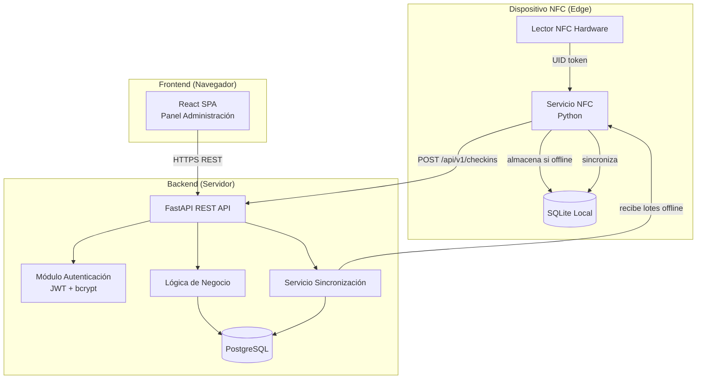
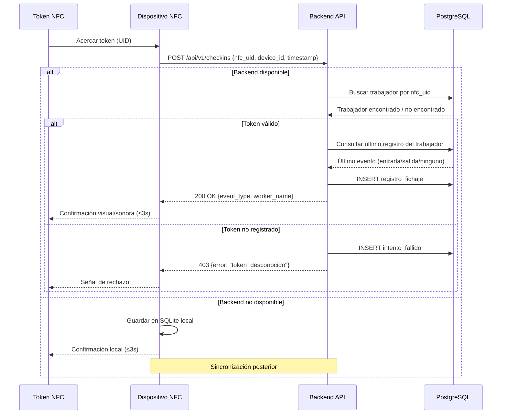
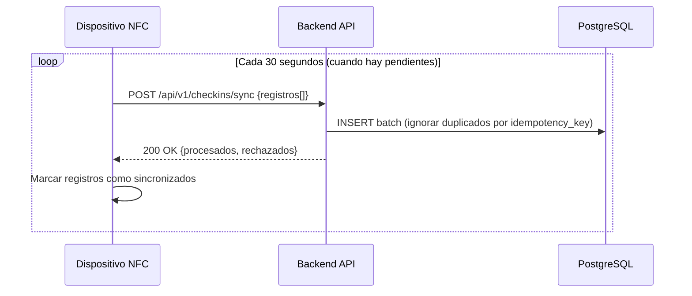

# Documento de Diseño Técnico: Employee Time Tracking

## Visión General

El sistema de fichaje de trabajadores mediante NFC es una aplicación distribuida compuesta por tres capas principales:

1. **Dispositivo NFC (Edge)**: Hardware embebido (p. ej. Raspberry Pi o microcontrolador ESP32 con lector NFC RC522/PN532) que detecta tokens NFC, determina el tipo de evento y envía el registro al backend.
2. **Backend API**: Servicio REST que gestiona la lógica de negocio, persiste los registros, autentica administradores y expone los datos al panel de administración.
3. **Panel de Administración (Frontend)**: Aplicación web SPA que permite al administrador consultar, filtrar y exportar registros de fichaje, así como gestionar trabajadores.

### Objetivos de diseño

- **Resiliencia**: El dispositivo NFC debe funcionar aunque el backend no esté disponible (almacenamiento local + sincronización posterior).
- **Seguridad**: Autenticación robusta, comunicaciones cifradas, registros inmutables.
- **Trazabilidad**: Log de auditoría completo para todas las operaciones administrativas.
- **Simplicidad operativa**: Despliegue sencillo, sin dependencias externas complejas.

### Stack tecnológico propuesto

| Capa | Tecnología |
|---|---|
| Backend API | Python 3.11 + FastAPI |
| Base de datos | PostgreSQL 15 |
| Autenticación | JWT (access token 30 min) + bcrypt |
| Dispositivo NFC | Python 3 + librería `keyboard` (lector USB HID, emulador de teclado) |
| Frontend | React 18 + TypeScript + Vite |
| Comunicación | HTTPS / REST JSON |
| Exportación CSV | Generación server-side con `csv` stdlib |
| Almacenamiento local NFC | SQLite (en el dispositivo) |

---

## Arquitectura

### Diagrama de componentes



### Diagrama de flujo: fichaje NFC



### Diagrama de flujo: sincronización offline



---

## Componentes e Interfaces

### 1. Servicio NFC (Edge)

**Hardware:** Lector USB HID (emulador de teclado) conectado por USB al PC Windows. Al acercar una tarjeta o llavero NFC, el lector envía el UID como pulsaciones de teclado seguidas de Enter (p. ej. `04A32B1C9F\n`). No requiere drivers especiales ni hardware embebido.

**Responsabilidades:**
- Capturar el UID que el lector USB HID "escribe" por teclado (librería `keyboard`).
- Enviar el evento al backend con reintentos.
- Almacenar localmente si el backend no responde.
- Sincronizar registros pendientes periódicamente.
- Activar confirmación visual en consola (modo Windows, sin LED/buzzer físico).

**Interfaz hacia el backend:**

```
POST /api/v1/checkins
Authorization: Bearer <device_token>
Content-Type: application/json

{
  "nfc_uid": "04:A3:2B:1C:9F",
  "device_id": "device-001",
  "detected_at": "2024-01-15T08:30:00Z",
  "idempotency_key": "uuid-v4"
}

Respuesta 200:
{
  "event_type": "entrada" | "salida",
  "worker_name": "Ana García",
  "recorded_at": "2024-01-15T08:30:01Z"
}

Respuesta 403:
{
  "error": "token_desconocido",
  "nfc_uid": "04:A3:2B:1C:9F"
}
```

```
POST /api/v1/checkins/sync
Authorization: Bearer <device_token>
Content-Type: application/json

{
  "records": [
    {
      "nfc_uid": "04:A3:2B:1C:9F",
      "device_id": "device-001",
      "detected_at": "2024-01-15T08:30:00Z",
      "idempotency_key": "uuid-v4"
    }
  ]
}
```

### 2. Backend API (FastAPI)

**Módulos:**

| Módulo | Ruta base | Responsabilidad |
|---|---|---|
| `auth` | `/api/v1/auth` | Login, logout, refresh token |
| `workers` | `/api/v1/workers` | CRUD trabajadores y tokens NFC |
| `checkins` | `/api/v1/checkins` | Registro y consulta de fichajes |
| `audit` | `/api/v1/audit` | Consulta log de auditoría |
| `export` | `/api/v1/export` | Exportación CSV |

**Endpoints principales:**

```
# Autenticación
POST   /api/v1/auth/login
POST   /api/v1/auth/logout

# Trabajadores
GET    /api/v1/workers
POST   /api/v1/workers
PUT    /api/v1/workers/{id}
PATCH  /api/v1/workers/{id}/deactivate
POST   /api/v1/workers/{id}/nfc-tokens

# Fichajes
POST   /api/v1/checkins                    (dispositivo NFC)
POST   /api/v1/checkins/sync               (sincronización offline)
GET    /api/v1/checkins?worker_id=&from=&to=&event_type=&page=&size=

# Exportación
GET    /api/v1/export/checkins.csv?worker_id=&from=&to=&event_type=

# Auditoría
GET    /api/v1/audit?from=&to=&admin_id=
```

### 3. Panel de Administración (React SPA)

**Páginas:**

| Página | Ruta | Descripción |
|---|---|---|
| Login | `/login` | Formulario de autenticación |
| Dashboard | `/` | Resumen y acceso rápido |
| Registros | `/checkins` | Tabla con filtros y exportación |
| Trabajadores | `/workers` | Gestión de trabajadores y tokens |
| Auditoría | `/audit` | Log de operaciones administrativas |

---

## Modelos de Datos

### Esquema PostgreSQL

```sql
-- Trabajadores
CREATE TABLE workers (
    id          UUID PRIMARY KEY DEFAULT gen_random_uuid(),
    full_name   VARCHAR(255) NOT NULL,
    employee_id VARCHAR(100) NOT NULL UNIQUE,  -- identificador único de empresa
    is_active   BOOLEAN NOT NULL DEFAULT TRUE,
    created_at  TIMESTAMPTZ NOT NULL DEFAULT NOW(),
    updated_at  TIMESTAMPTZ NOT NULL DEFAULT NOW()
);

-- Tokens NFC (un trabajador puede tener varios tokens)
CREATE TABLE nfc_tokens (
    id          UUID PRIMARY KEY DEFAULT gen_random_uuid(),
    nfc_uid     VARCHAR(100) NOT NULL UNIQUE,   -- UID del token NFC
    worker_id   UUID NOT NULL REFERENCES workers(id),
    is_active   BOOLEAN NOT NULL DEFAULT TRUE,
    assigned_at TIMESTAMPTZ NOT NULL DEFAULT NOW()
);

-- Registros de fichaje (inmutables: sin UPDATE ni DELETE)
CREATE TABLE checkin_records (
    id               UUID PRIMARY KEY DEFAULT gen_random_uuid(),
    worker_id        UUID NOT NULL REFERENCES workers(id),
    nfc_uid          VARCHAR(100) NOT NULL,
    event_type       VARCHAR(10) NOT NULL CHECK (event_type IN ('entrada', 'salida')),
    recorded_at      TIMESTAMPTZ NOT NULL,          -- marca de tiempo UTC del evento
    device_id        VARCHAR(100) NOT NULL,
    idempotency_key  UUID NOT NULL UNIQUE,           -- previene duplicados en sync
    synced_from_local BOOLEAN NOT NULL DEFAULT FALSE -- indica si vino de sync offline
);

-- Intentos fallidos (tokens desconocidos)
CREATE TABLE failed_attempts (
    id          UUID PRIMARY KEY DEFAULT gen_random_uuid(),
    nfc_uid     VARCHAR(100) NOT NULL,
    device_id   VARCHAR(100) NOT NULL,
    attempted_at TIMESTAMPTZ NOT NULL DEFAULT NOW()
);

-- Administradores
CREATE TABLE admins (
    id            UUID PRIMARY KEY DEFAULT gen_random_uuid(),
    username      VARCHAR(100) NOT NULL UNIQUE,
    password_hash VARCHAR(255) NOT NULL,            -- bcrypt
    is_active     BOOLEAN NOT NULL DEFAULT TRUE,
    created_at    TIMESTAMPTZ NOT NULL DEFAULT NOW()
);

-- Log de auditoría (inmutable)
CREATE TABLE audit_log (
    id           UUID PRIMARY KEY DEFAULT gen_random_uuid(),
    admin_id     UUID NOT NULL REFERENCES admins(id),
    operation    VARCHAR(100) NOT NULL,             -- ej: "worker.create", "worker.deactivate"
    entity_type  VARCHAR(50) NOT NULL,
    entity_id    UUID,
    details      JSONB,                             -- datos adicionales de la operación
    performed_at TIMESTAMPTZ NOT NULL DEFAULT NOW()
);

-- Control de bloqueo por IP (autenticación)
CREATE TABLE ip_lockouts (
    ip_address      VARCHAR(45) PRIMARY KEY,
    failed_attempts INTEGER NOT NULL DEFAULT 0,
    locked_until    TIMESTAMPTZ,
    last_attempt_at TIMESTAMPTZ NOT NULL DEFAULT NOW()
);
```

### Índices de rendimiento

```sql
CREATE INDEX idx_checkin_worker_recorded ON checkin_records(worker_id, recorded_at DESC);
CREATE INDEX idx_checkin_recorded ON checkin_records(recorded_at DESC);
CREATE INDEX idx_checkin_event_type ON checkin_records(event_type);
CREATE INDEX idx_nfc_tokens_uid ON nfc_tokens(nfc_uid) WHERE is_active = TRUE;
CREATE INDEX idx_audit_performed ON audit_log(performed_at DESC);
CREATE INDEX idx_audit_admin ON audit_log(admin_id, performed_at DESC);
```

### Modelo de dominio (Python / Pydantic)

```python
from pydantic import BaseModel
from datetime import datetime
from uuid import UUID
from typing import Optional, Literal

class Worker(BaseModel):
    id: UUID
    full_name: str
    employee_id: str
    is_active: bool
    created_at: datetime
    updated_at: datetime

class NfcToken(BaseModel):
    id: UUID
    nfc_uid: str
    worker_id: UUID
    is_active: bool
    assigned_at: datetime

class CheckinRecord(BaseModel):
    id: UUID
    worker_id: UUID
    nfc_uid: str
    event_type: Literal["entrada", "salida"]
    recorded_at: datetime          # UTC
    device_id: str
    idempotency_key: UUID
    synced_from_local: bool

class FailedAttempt(BaseModel):
    id: UUID
    nfc_uid: str
    device_id: str
    attempted_at: datetime

class AuditLogEntry(BaseModel):
    id: UUID
    admin_id: UUID
    operation: str
    entity_type: str
    entity_id: Optional[UUID]
    details: Optional[dict]
    performed_at: datetime
```

### Modelo SQLite local (dispositivo NFC)

```sql
-- Registros pendientes de sincronización
CREATE TABLE pending_checkins (
    id               INTEGER PRIMARY KEY AUTOINCREMENT,
    nfc_uid          TEXT NOT NULL,
    device_id        TEXT NOT NULL,
    detected_at      TEXT NOT NULL,   -- ISO 8601 UTC
    idempotency_key  TEXT NOT NULL UNIQUE,
    synced           INTEGER NOT NULL DEFAULT 0,  -- 0=pendiente, 1=sincronizado
    created_at       TEXT NOT NULL DEFAULT (datetime('now'))
);
```

---

## Propiedades de Corrección

*Una propiedad es una característica o comportamiento que debe mantenerse verdadero en todas las ejecuciones válidas de un sistema — esencialmente, una declaración formal sobre lo que el sistema debe hacer. Las propiedades sirven como puente entre las especificaciones legibles por humanos y las garantías de corrección verificables por máquina.*

### Propiedad 1: Alternancia correcta del tipo de evento

*Para cualquier* trabajador y cualquier historial de fichajes, el tipo de evento de un nuevo fichaje debe ser siempre el opuesto al tipo del último registro existente (entrada → salida, salida → entrada). Si no existe ningún registro previo, el primer fichaje debe ser siempre de tipo entrada. Además, la respuesta de la API debe incluir el campo `event_type` con el valor determinado.

**Valida: Requisitos 5.1, 5.2, 5.3**

---

### Propiedad 2: Idempotencia de sincronización offline

*Para cualquier* lote de registros de fichaje enviados al endpoint de sincronización, enviar el mismo lote una o más veces adicionales no debe crear registros duplicados ni modificar los ya existentes. El estado final de la base de datos debe ser idéntico independientemente del número de veces que se envíe el mismo lote.

**Valida: Requisitos 1.5**

---

### Propiedad 3: Unicidad de token NFC activo

*Para cualquier* UID de token NFC ya asignado a un trabajador activo, intentar asignarlo a cualquier otro trabajador activo debe ser rechazado con error de conflicto. En ningún momento puede existir más de un trabajador activo con el mismo token.

**Valida: Requisitos 2.5**

---

### Propiedad 4: Inmutabilidad de registros de fichaje

*Para cualquier* registro de fichaje creado en la base de datos, ninguna operación de la API (PUT, PATCH, DELETE) debe poder modificarlo o eliminarlo. El conjunto de registros de fichaje solo puede crecer mediante nuevas inserciones.

**Valida: Requisitos 6.1**

---

### Propiedad 5: Corrección, completitud y orden de las consultas de registros

*Para cualquier* combinación de filtros (trabajador, rango de fechas, tipo de evento), todos los registros devueltos deben: (a) satisfacer todos los criterios del filtro aplicado, (b) no excluir ningún registro que satisfaga todos los criterios, (c) estar ordenados por `recorded_at` de forma descendente, y (d) incluir los campos `worker_name`, `event_type`, fecha y hora con zona horaria.

**Valida: Requisitos 3.1, 3.2, 3.4**

---

### Propiedad 6: Bloqueo por intentos fallidos de autenticación

*Para cualquier* dirección IP, tras exactamente 5 intentos de autenticación fallidos consecutivos, todos los intentos de login posteriores desde esa IP deben ser rechazados durante al menos 15 minutos, independientemente de si las credenciales proporcionadas son correctas o no.

**Valida: Requisitos 4.3**

---

### Propiedad 7: Conservación de histórico al desactivar trabajador

*Para cualquier* trabajador con N registros de fichaje históricos, desactivarlo no debe reducir el número de registros accesibles. Los N registros deben seguir siendo consultables desde el panel de administración tras la desactivación.

**Valida: Requisitos 2.4**

---

### Propiedad 8: Fidelidad de exportación CSV respecto a la consulta

*Para cualquier* conjunto de filtros aplicados en la consulta de registros, el archivo CSV exportado debe contener exactamente los mismos registros (mismo conjunto, mismos campos) que devuelve la consulta con esos mismos filtros, sin importar la paginación.

**Valida: Requisitos 3.5**

---

### Propiedad 9: Rechazo de tokens NFC desconocidos con registro de intento

*Para cualquier* UID de token NFC que no esté registrado en el sistema, el intento de fichaje debe ser rechazado (HTTP 403) y debe crearse un registro en `failed_attempts` con el UID del token y la marca de tiempo del intento.

**Valida: Requisitos 1.4**

---

### Propiedad 10: Rechazo de fichajes de trabajadores desactivados

*Para cualquier* trabajador desactivado, cualquier intento de fichaje con sus tokens NFC debe ser rechazado por el sistema, sin crear ningún registro de fichaje válido.

**Valida: Requisitos 2.3**

---

### Propiedad 11: Completitud del log de auditoría

*Para cualquier* operación de gestión de trabajadores realizada por un administrador (crear, desactivar, asignar token), debe existir exactamente una entrada en el log de auditoría que contenga el identificador del administrador, el tipo de operación y la marca de tiempo de la operación.

**Valida: Requisitos 6.2**

---

### Propiedad 12: Mensaje de error genérico en autenticación fallida

*Para cualquier* combinación de nombre de usuario y contraseña incorrectos (usuario correcto + contraseña incorrecta, usuario incorrecto + contraseña correcta, ambos incorrectos), el mensaje de error devuelto por la API debe ser siempre idéntico, sin revelar qué campo es incorrecto.

**Valida: Requisitos 4.2**

---

### Propiedad 13: Protección de endpoints con autenticación JWT

*Para cualquier* endpoint protegido de la API, una petición con token JWT ausente, malformado, expirado o con firma inválida debe ser rechazada con HTTP 401, sin devolver ningún dato de la aplicación.

**Valida: Requisitos 4.1**

---

## Manejo de Errores

### Estrategia general

Todos los errores del backend siguen un formato JSON uniforme:

```json
{
  "error": "codigo_error",
  "message": "Descripción legible del error",
  "details": {}
}
```

### Tabla de errores por dominio

| Escenario | Código HTTP | Código de error | Comportamiento |
|---|---|---|---|
| Token NFC desconocido | 403 | `token_desconocido` | Registrar intento fallido, señal de rechazo en dispositivo |
| Token NFC ya asignado | 409 | `token_ya_asignado` | Rechazar operación, mostrar mensaje de conflicto |
| Credenciales incorrectas | 401 | `credenciales_invalidas` | Mensaje genérico sin revelar campo incorrecto |
| IP bloqueada | 429 | `ip_bloqueada` | Indicar tiempo restante de bloqueo |
| Sesión expirada | 401 | `sesion_expirada` | Redirigir al login |
| Backend no disponible (dispositivo) | — | — | Almacenar en SQLite local, reintentar |
| Error de validación | 422 | `validacion_fallida` | Detalles de campos inválidos |
| Error interno | 500 | `error_interno` | Log interno, mensaje genérico al cliente |

### Resiliencia del dispositivo NFC

El servicio NFC implementa el siguiente algoritmo de resiliencia:

```
1. Detectar token NFC
2. Intentar POST /api/v1/checkins (timeout: 2s)
3. Si respuesta exitosa:
   a. Activar confirmación visual/sonora
   b. Fin
4. Si error de red o timeout:
   a. Guardar en SQLite local con idempotency_key único
   b. Activar confirmación local (modo offline)
   c. Programar sincronización en background
5. Bucle de sincronización (cada 30s):
   a. Si hay registros pendientes Y backend disponible:
      - Enviar lote al endpoint /sync
      - Marcar como sincronizados los procesados
```

### Manejo de errores de autenticación

- Los mensajes de error de login son siempre genéricos: "Credenciales incorrectas" (no se indica si falla usuario o contraseña).
- El contador de intentos fallidos se resetea tras un login exitoso.
- El bloqueo por IP es independiente del usuario intentado.

---

## Estrategia de Pruebas

### Enfoque dual: pruebas unitarias + pruebas basadas en propiedades

El sistema utiliza un enfoque de pruebas en dos niveles complementarios:

- **Pruebas unitarias/de ejemplo**: verifican comportamientos concretos, casos límite y condiciones de error.
- **Pruebas basadas en propiedades (PBT)**: verifican propiedades universales sobre rangos amplios de entradas generadas aleatoriamente.

### Librería de PBT

Se utilizará **Hypothesis** (Python) para las pruebas basadas en propiedades del backend. Cada prueba de propiedad se ejecutará con un mínimo de **100 iteraciones**.

Etiqueta de referencia por prueba:
```
# Feature: employee-time-tracking, Propiedad N: <texto de la propiedad>
```

### Pruebas basadas en propiedades (backend)

Cada propiedad del documento se implementa como una prueba Hypothesis:

| Propiedad | Descripción | Estrategia de generación |
|---|---|---|
| P1: Tipo de evento alternante | Verificar que la lógica de alternancia es correcta para cualquier historial | Generar historiales de longitud variable con eventos aleatorios |
| P2: Idempotencia de sincronización | Enviar el mismo lote N veces produce el mismo estado | Generar lotes de registros, enviar 1-5 veces |
| P3: Unicidad de token activo | No puede haber dos trabajadores activos con el mismo token | Generar asignaciones de tokens y verificar invariante |
| P4: Inmutabilidad de registros | Ninguna operación modifica registros existentes | Generar registros, intentar todas las operaciones de escritura |
| P5: Corrección del filtrado | Filtros devuelven exactamente los registros correctos | Generar conjuntos de registros y combinaciones de filtros |
| P6: Bloqueo por IP | Exactamente 5 fallos consecutivos activan el bloqueo | Generar secuencias de intentos fallidos/exitosos |
| P7: Conservación de histórico | Desactivar trabajador no elimina sus registros | Generar trabajadores con registros, desactivar y verificar |
| P8: Fidelidad de exportación CSV | CSV contiene exactamente los mismos registros que la consulta | Generar registros y filtros, comparar consulta vs CSV |

### Pruebas unitarias (ejemplos concretos)

- **Autenticación**: login exitoso, credenciales incorrectas, sesión expirada, bloqueo por IP.
- **Gestión de trabajadores**: registro, desactivación, asignación de token duplicado.
- **Fichaje**: token válido, token desconocido, primer fichaje (sin historial).
- **Exportación CSV**: formato de columnas, codificación UTF-8, separador correcto.
- **Auditoría**: verificar que cada operación administrativa genera entrada en el log.

### Pruebas de integración

- Flujo completo de fichaje: dispositivo → API → base de datos.
- Flujo offline: fichaje sin backend → sincronización posterior.
- Flujo de autenticación: login → acceso protegido → expiración de sesión.
- Exportación CSV con filtros combinados.

### Pruebas de seguridad

- Verificar que HTTPS es obligatorio (rechazar HTTP).
- Verificar que endpoints protegidos rechazan tokens JWT inválidos/expirados.
- Verificar que mensajes de error de autenticación no revelan información sensible.
- Verificar que registros de fichaje no son modificables vía API.

### Cobertura objetivo

| Capa | Cobertura mínima |
|---|---|
| Lógica de negocio (backend) | 90% |
| Endpoints API | 85% |
| Servicio NFC (edge) | 80% |
| Frontend (componentes críticos) | 70% |
